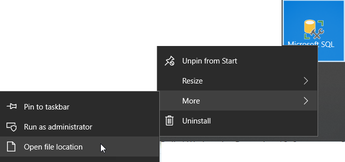

Being more productive with SSMS

# Start faster

Modify your shortcut to include the `/nosplash` parameter

1. Find the shortcut file

2. Right click and select `Properties`

   

3. Append ` /nosplash` to the end of the Target (there is a space after Ssms.exe" and the /nosplash parameter)

Target: `"C:\Program Files (x86)\Microsoft SQL Server\140\Tools\Binn\ManagementStudio\Ssms.exe" /nosplash`

# Registered Servers

Registered servers is a user defined lists and groups of servers.

Quick, answer these questions (must show your work for credit) for all of your servers 

Am I patched up? `SELECT SERVERPROPERTY('ProductVersion') AS WhatIsMyVersion;`

What's going on? `EXECUTE dbo.sp_WhoIsActive;`

Categorize servers into meaningful groups and color code connections.

## Exporting registered servers

Get the new person up to speed in a flash 

# Drag show

Did you know everything is draggable?

Object Explorer

Drag a table name

Drag a column name

Drag the Columns

Shift-Alt drag or shift-alt-arrow (Block select/edit)

# Regular Expressions

https://docs.microsoft.com/en-us/visualstudio/ide/using-regular-expressions-in-visual-studio?view=vs-2015

