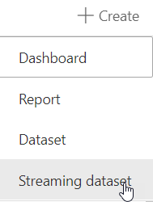
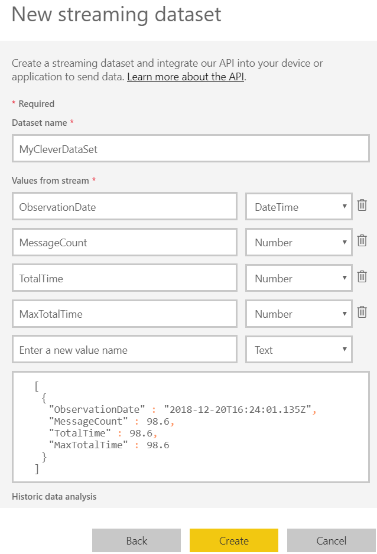
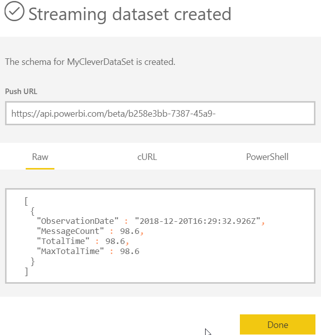

# Streaming data and Power BI

We built a PBI streaming dashboard for a client that uses a messaging (Service Broker) platform. Traditional reporting solutions were ineffective as the volume and velocity of data was such that looking at data from 5 minutes ago was an eternity. Additionally, when things go bad, they go bad in a *hurry*.

# Getting started

Create a Power BI account if you don't already have one. It's free. If you want someone else to see your report, you will need a Power BI Pro license, which is $10 a month. 

You can only create streaming datasets and the dashboards that consume them via the PBI Service, aka powerbi.com 

# Identify your data

We created a query that exposed the metrics we needed to be able to support Service Broker. We identified how many messages were waiting to be processed, how long processing is taking, how long is it taking for messages to get to us from the source, etc for the past second and aggregated it. Any larger and the averages would flatten the spikes, any smaller and we'd hit the capacity for the free tier.

# Create your dataset/endpoint

Datasets, Create, Streaming dataset, API




## Describe the dataset

Define the shape of the inbound data. Data types: DateTime, Number, and Text. Period. Full Stop.





## Acquire endpoint

At this point, you have a Push URL to throw data against. This is a critical screen as it shows the URL  as well as how you need to marshal your data for ingestion against the api.





# Choose your own adventure

## Stream data

We build a windows service to ensure our metrics are constantly being transmitted to the service. The meat of process is "just a web call."

```c#
// metrics is a struct and GetData ...gets the data
metrics = GetData();
// Send POST request to the push URL
WebRequest request = WebRequest.Create(this.RealTimePushUrl);
request.Method = "POST";

//Build JSON String for POST
// Yes, I'm string building and could malform my json
string postData = String.Format("[{{\"ObservationDate\":\"{0}\",\"MessageCount\":{1},\"TotalTime\":{2},\"MaxTotalTime\":{3}", metrics.TimeStamp, metrics.MessageCount, metrics.TotalTime, metrics.MaxTotalTime, metrics.MessageCount);

// Prepare request for sending
byte[] byteArray = Encoding.UTF8.GetBytes(postData);
request.ContentLength = byteArray.Length;

// Get the request stream.
using (Stream dataStream = request.GetRequestStream())
{
	// Write the data to the request stream.
	dataStream.Write(byteArray, 0, byteArray.Length);
}
```


## Design your dashboard

You can only build your dashboard within the PowerBI Service. No Desktop experience. No migration story. Visualizations options and configurations are rather limited.


# References

https://docs.microsoft.com/en-us/power-bi/service-real-time-streaming

https://docs.microsoft.com/en-us/power-bi/service-features-license-type


